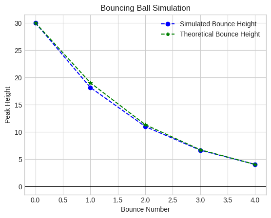
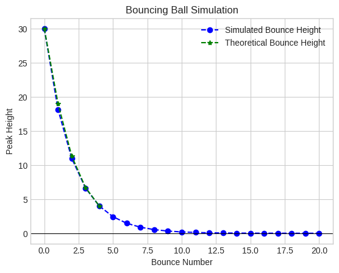

# The Bouncing Golf Ball 

A rather bounce-adverse golf ball - the same one that once blew through my grandparent's back window pane some 20 years ago in upstate NY - was used to simulate the geometric series. By marking up the wall with tape and still present ink, the height of each bounce was measured. The ball dropped from an initial height of 30inches 3 times. The bounces in these trials were then averaged to produce the measured values used in finding the common ratio (r)representing loss of bounce energy. The average values for the bounce heights including the initial drop height were 30.0, 19.0, 11.3, 6.7, and 4.0. Visual parallax was accounted for by adding or subtracting an inch or so every few inches (or so) from the pre-average values. As such, the first bounce had two inches subtracted, the second had once inch subtracted, the third had once inch added and the fourth had 2 inches added. 

Using the given formula for r, the ratio was determined to be 0.6. Using proper summation notation, this can be modeled into a single infinite geometric series: 

$$
\
D = h_0 + 2h_0 \sum_{n=1}^{\infty} r^n
\
$$

Summing this infinite series using the formula, it was found that the theoretic distance totaled 122.71 inches.

$$
\
Theoretic Distance = height_0 + 2 height_0 * r / (1 - r)
\
$$

## Simulation
Using the common ratio, this experiment was then simulated up to 20 bounces. The percent error between the theoretical value and the simulated one - 121.7 - was negligible, despite the large difference in bounce count due to the rapid decay in bounce height.  The measured distance between the simulation and the theoretical distance came out to 0.004. This could have been due to a rounding error. 

On the other hand, simulating the ball bouncing five times  produced a percent error fo 10.1% with a total difference in value btw the theoretical value and the sim 12.246inches. The values in the sim [30.0, 18.135, 10.963, 6.627, 4.006] were slightly different from the initial measured values. 

**Graphing was completed with assistance from Google Colaboratory